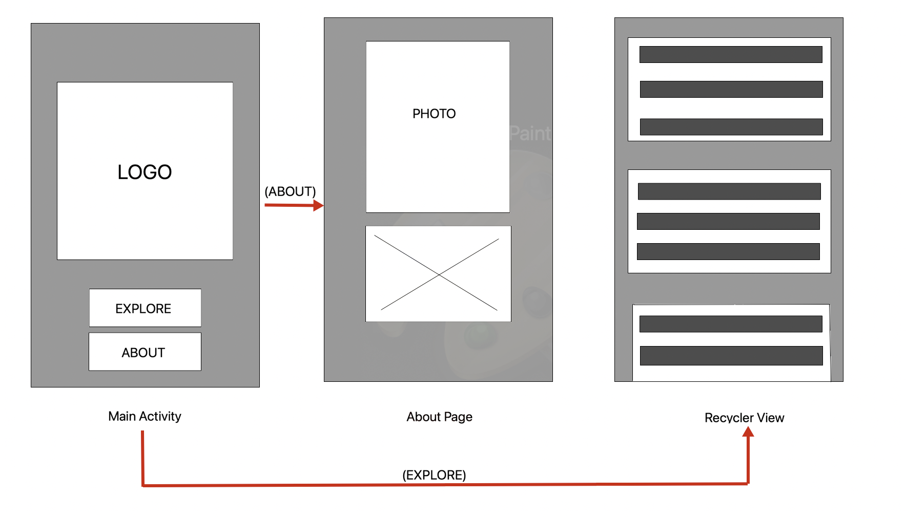
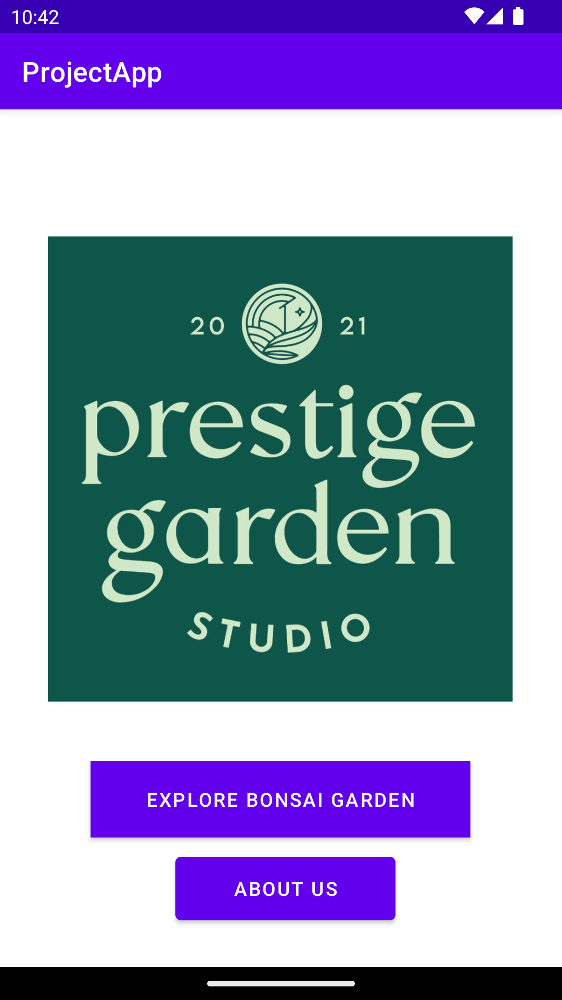
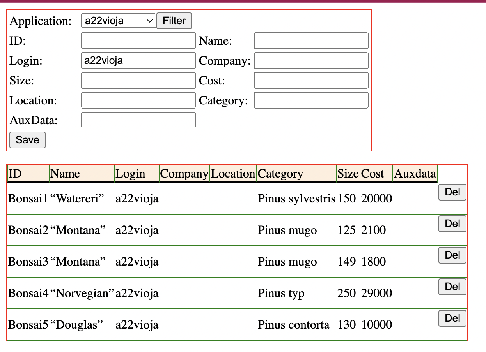
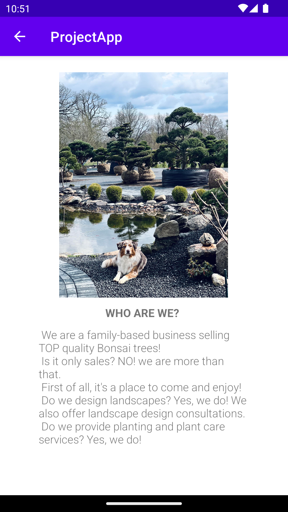
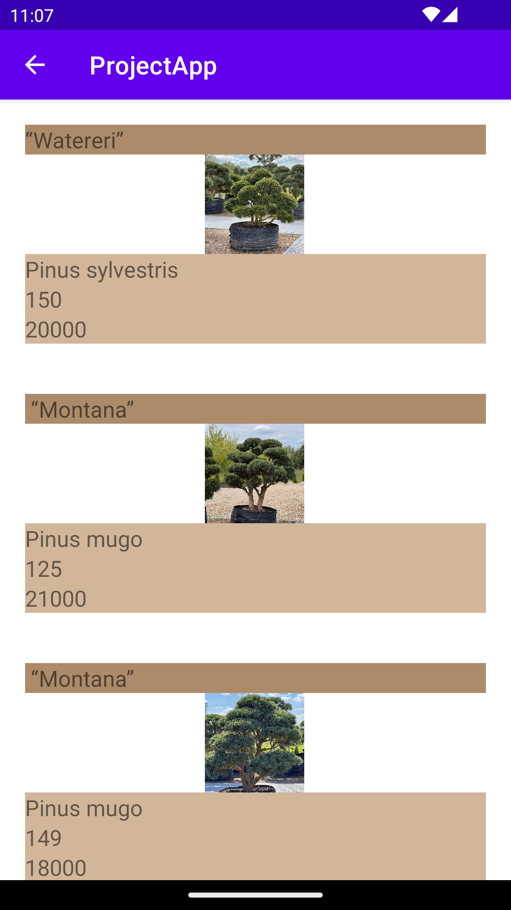

# ProjectApp

#About the Project Prestige Garden Studio

This project is based on my friends business company which sells Bonsai trees.
The idea for the app is to show main page as a welcome screen with the button "Explore Bonsai Garden" which takes the user to Recycler View page 
where all the Bonsai trees are listed and button "About us" where business owner presents the main activities of their company. 

This is the skis of an idea:


This is the main page of my App project:


#JSON FILE

App presents data of the Bonsai trees with JSON-data from the university web. 
This line of the code (Figure 1) is in the BonsaiPage: 

Figure 1
```
private final String JSON_URL = "https://mobprog.webug.se/json-api?login=a22vioja";
```

In the figure 1.1 is the Json file:

Figure 1.1
```
[{"ID":"Bonsai1","name":"“Watereri” ","type":"a22vioja","company":"","location":"",
"category":"Pinus sylvestris ","size":150,"cost":20000,"auxdata":""},{"ID":"Bonsai2",
"name":" “Montana”","type":"a22vioja","company":"","location":"","category":"Pinus mugo"
,"size":125,"cost":2100,"auxdata":""},{"ID":"Bonsai3","name":" “Montana”",
"type":"a22vioja","company":"","location":"","category":"Pinus mugo","size":149,
"cost":1800,"auxdata":""},{"ID":"Bonsai4","name":" “Norvegian”","type":"a22vioja",
"company":"","location":"","category":"Pinus typ","size":250,"cost":29000,"auxdata":""}
,{"ID":"Bonsai5","name":" “Douglas”","type":"a22vioja","company":"","location":"",
"category":"Pinus contorta","size":130,"cost":10000,"auxdata":""}]
```

This is the screenshot of the data in Json file (Figurre 1.2):




This is en example of an object from the Bonsai class(Figure 2). There are 6 atributes all together 
in Json file: Name, ID, Size, Cost, Category and login. Name attribute is the name of the 
Bonsai tree - for example “Watereri”. ID is the unik value for every tree, for example "Bonsai1".
Size is implemented as a tree height, för example: "150" cm. Cost is the price for the tree - 
"20 000" kr and the category is the type of the tree - for this example it is "Pinus Sylvestris".

Figure 2
```
public class Bonsai {
    @SerializedName("Name")
    public String name;
    @SerializedName("ID")
    public String id;
    @SerializedName("Size")
    public String height;
    @SerializedName("Cost")
    public int price;
    @SerializedName("Category")
    public String category;

    public Bonsai(String name, String id, String height, int price, String category) {
        this.name = name;
        this.id = id;
        this.height = height;
        this.price = price;
        this.category = category;
    }
```

#IMPLEMENTATION

I created recyclerview_item xml file for the one Bonsai tree to be shown on the screen. 
One item includes the information about name, category, height and price(Figure 3).

Figure 3
```
<TextView
        android:id="@+id/name"
        android:layout_width="match_parent"
        android:layout_height="wrap_content"
        android:textSize="18sp" />

    <TextView
        android:id="@+id/category"
        android:layout_width="match_parent"
        android:layout_height="wrap_content"
        android:textSize="18sp" />

    <TextView
        android:id="@+id/height"
        android:layout_width="match_parent"
        android:layout_height="wrap_content"
        android:textSize="18sp" />

    <TextView
        android:id="@+id/price"
        android:layout_width="match_parent"
        android:layout_height="wrap_content"
        android:textSize="18sp" />
```


This is the link to the relevant commit:
https://github.com/a22vioja/ProjectApp/commit/0ef65ee22b52c0c644ddde3894c45eda89a5335a

I created About page activity for the description of the business and presentation 
of the services it provides(Figure 4).

Figure 4
```
public class About extends AppCompatActivity {

    @Override
    protected void onCreate(Bundle savedInstanceState) {
        super.onCreate(savedInstanceState);
        setContentView(R.layout.activity_about);
    }
}
```
It also includes XML file which provides the view for the app(Figure 5):

Figure 5
```
<TextView
        android:id="@+id/textView2"
        android:layout_width="116dp"
        android:layout_height="41dp"
        android:text="WHO ARE WE?"
        android:textSize="16sp"
        android:textStyle="bold"
        app:layout_constraintBottom_toTopOf="@+id/textView"
        app:layout_constraintEnd_toEndOf="parent"
        app:layout_constraintStart_toStartOf="parent" />

    <ImageView
        android:id="@+id/imageView3"
        android:layout_width="223dp"
        android:layout_height="200dp"
        app:layout_constraintBottom_toTopOf="@+id/textView2"
        app:layout_constraintEnd_toEndOf="parent"
        app:layout_constraintStart_toStartOf="parent"
        app:layout_constraintTop_toTopOf="parent"
        app:layout_constraintVertical_bias="0.764"
        app:srcCompat="@drawable/_80206811_5344780035573434_404496635289364981_n" />

```
These are the links to the relevant commit:
https://github.com/a22vioja/ProjectApp/commit/5a61f4ee2e8fd026a32364d39f43d46dd5b6ad24
https://github.com/a22vioja/ProjectApp/commit/8e1ab3ea8d629ff3bb0a21e9af3874832260e8f1
https://github.com/a22vioja/ProjectApp/commit/8a3a82c5162c1983070326394a3ebde27af720b4

This is the About Page screen:



This is the implementation of Recycler view in BonsaiPage(Figure 6). BonsaiPage class 
implements JsonTask to get the data parsed from Json file. RecyclerView implements 
onCreate method where adapter is an instance of the MyAdapter class for populating
the RecyclerView with data. 
The onPostExecute method is called when the JSON data is fetched successfully and it
receives the JSON data as a string (json).A Gson instance is created to deserialize the JSON data.

Figure6
```
public class BonsaiPage extends AppCompatActivity implements JsonTask.JsonTaskListener {

    private final String JSON_URL = "https://mobprog.webug.se/json-api?login=a22vioja";
    ArrayList<Bonsai> listOfBonsai;
   // private RecyclerView.ViewHolder holder;
    MyAdapter adapter;

    @Override
    protected void onCreate(Bundle savedInstanceState) {
        super.onCreate(savedInstanceState);
        setContentView(R.layout.activity_bonsai_page);

        listOfBonsai = new ArrayList<Bonsai>();

        adapter=new MyAdapter(this, listOfBonsai, new MyAdapter.OnClickListener() {
            @Override
            public void onClick(Bonsai item) {
                Toast.makeText(BonsaiPage.this, item.getName(), Toast.LENGTH_SHORT).show();
            }
        });

        RecyclerView view = findViewById(R.id.recycler_view);
        view.setLayoutManager(new LinearLayoutManager(this));
        view.setAdapter(adapter);

        new JsonTask(this).execute(JSON_URL);

    }

    @Override
    public void onPostExecute(String json) {
        Log.d("MainActivity", json);

        Gson gson = new Gson();
        Type type = new TypeToken<ArrayList<Bonsai>>() {}.getType();

        adapter.addData(listOfBonsai);

        ArrayList<Bonsai> listOfBonsai = gson.fromJson(json, type);
        if (listOfBonsai != null) {
            adapter.addData(listOfBonsai);
            adapter.notifyDataSetChanged();
        } else {
            Log.d("BonsaiPage", "Error: Empty list of Bonsai"); // Provide a relevant error message
        }

        adapter.notifyDataSetChanged();

    }
```

This is the link to the relevant commit:
https://github.com/a22vioja/ProjectApp/commit/2562fe745d69edc5b01fac5f5514d1b76340c42e

This is the screen of the BonsaiPage after pressing "Explore Bonsai Garden" button:
